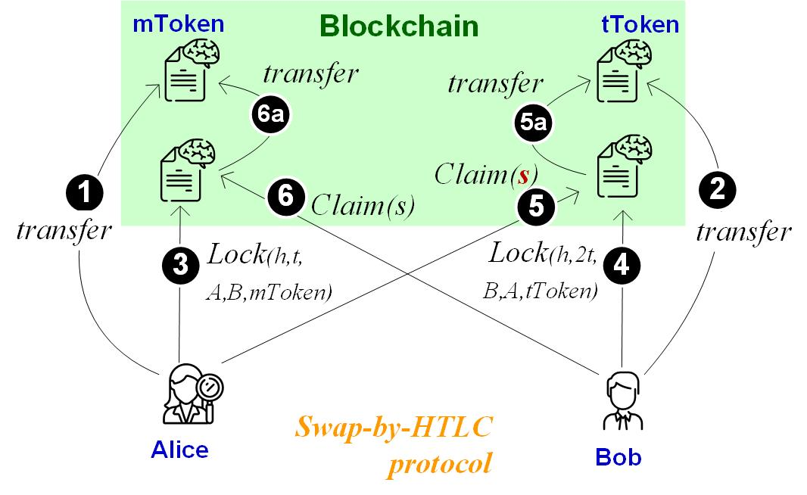

Lab 4: Atomic Multi-tx Swaps on HTLC
===

Introduction
---

Swapping the ownership of two tokens on two accounts is a fundamental DeFi service. While swap atomicity in DEX is enforced by having two transfers done in a single transaction, there are practical scenarios where a swap of two accounts' ownership needs to be done in two transactions. An example is cross-chain swaps. In this lab, you will implement a multi-transaction swap using HTLC.

Task 1. Implement an HTLC
---

`HTLC` or hash time lock contract is parameterized by hash `h`, timeout `t`, sender account `A` and receiver account `B`. `HTLC(h,t,A,B,2mToken)` stores a deposit of 2 mTokens and there are two outcomes: 1) before the timeout `t`, if the `HTLC` smart contract receives receiver `B`'s transaction revealing secret `s` such that `h=H(s)`, the 2 mTokens will be transferred to `B`'s account. 2) after the timeout `t`, if case 1) did not happen, the `HTLC` smart contract returns the deposit to sender `A`.

Your job is to implement `HTLC` smart contract. 

Task 2. Execute atomic multi-tx swap using two HTLC's
---

An atomic multi-transaction swap can run based on two HTLC smart contracts. The protocol is described in the figure below.

Run the above atomic swap protocol based on your `HTLC` smart contracts implemented in Task 1.
