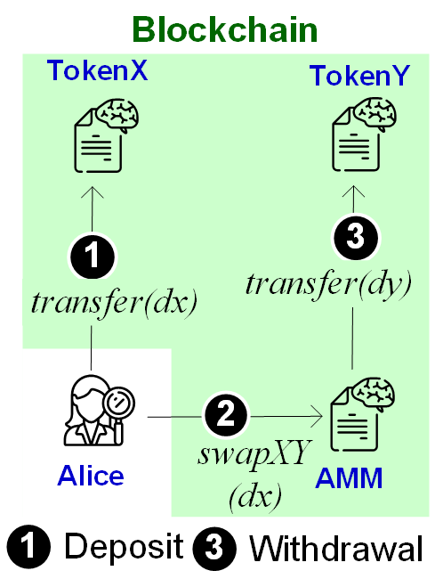

Lab B1: AMM DEX
===

Introduction
---

An automated market maker (AMM) is a decentralized-exchange (DEX) protocol. In an AMM, a trader trades with a smart-contract intermediary called pool (which is unlike other DEX designs like order book).
In practice, AMM is the most widely adopted DEX design and is the protocol followed by popular services including Uniswap, Sushiswap, Pancakeswap, etc.

In this lab, you will being implement an AMM.


| Tasks | Points | CS student | Finance student |
| --- | --- | --- | --- |
|  1  | 20 |  Required | Bonus |
|  2  | 30 | Required | Bonus |
|  3  | 50 | Required | Bonus |


Exercise 1. Execute ERC20 token transfer
---

The following smart contract implements a very simple token supporting the essential transfer function: `transfer(address sender, address recipient, uint256 amount)` 

```
pragma solidity >=0.7.0 <0.9.0; 
contract BaddToken {  
  uint _totalSupply = 0; string _symbol;  
  mapping(address => uint) balances;  
  constructor(string memory symbol, uint256 initialSupply) {
    _symbol = symbol;
    _totalSupply = initialSupply;
    balances[msg.sender] = _totalSupply;  
  }
  
  function transfer(address receiver, uint amount) public returns (bool) {    
    require(amount <= balances[msg.sender]);        
    balances[msg.sender] = balances[msg.sender] - amount;    
    balances[receiver] = balances[receiver] + amount;    
    return true;  
  }

  function balanceOf(address account) public view returns(uint256){
    return balances[account];
  }}
```

Your job in this exercise is to deploy the above smart contract in Remix, creating an `TokenX` instance. Demonstrate the process that the `TokenX` issuer transfers 10 `TokenX` to another account, say Alice, and display each account's balance before/after the transfer.


Exercise 2. Extend `BaddToken` with approve/transferFrom
---

```
function approve(address spender, uint256 amount) external returns (bool);
function transferFrom(address from, address to, uint256 amount) external returns (bool);
function allowance(address owner, address spender) external view returns (uint256);
```

Your job is to extend the `BaddToken` with the approve and transferFrom functions defined as above. Suppose owner Alice wants to transfer 1 `BaddToken` to another account Bob through an intermediary Charlie. Alice first calls `approve(Charlie, 1)` which gives Charlie allowance of 1 `BaddToken`. Then, Charlie calls function `transferFrom(Alice, Bob, 1)`, through which Charlie's balance is credited by 1 `BaddToken` and Alice's balance is debited by 1 `BaddToken`.

Deploy the extended `BaddToken` SC in Remix. We use the following table to test/grade if your deployed token SC is correct. 
For instance, we may send a sequence of transaction against the instances of your `BaddToken`: `A.approve(C, 1)`, `balanceOf(A)`, `allowance(A, C)`, `balanceOf(B)`, `C.transferFrom(A, B, 1)`, `balanceOf(B)`. And we expect a correct result being `1,1,0,1`.

| Calls | `balanceOf(A)` | `balanceOf(B)` | `allowance(A,C)` | 
| --- | --- | --- | --- |
| Init state  | 1 | 0 | 0 |
| `A.approve(C,1)` | 1 | 0 | 1 |
| `C.transferFrom(A,B,1)` | 0 | 0 | 1 |

Exercise 3. AMM Design with Fixed Rate
---


<!--  -->

The figure above shows the workflow of the fixed-rate AMM you are going to build. Initially, two token contract accounts i.e., `TokenX` and `TokenY` are created by deploying the extended `BaddToken` you built in Exercise 2.

In Step 1, trader Alice approves $x$ units of `TokenX` from her account (EOA) to the AMM `Pool`'s contract account (CA). In Step 2, Alice calls the `Pool`'s function `swapXY(dx)`. Upon receiving Alice's transaction, the `Pool` internally calls `TokenY`'s `transfer` function to transfer $dy$ units of `TokenY` to Alice (Step 3). The `Pool` also internally calls `TokenX`'s `transferFrom` function to transfer Alice's $dx$ units of `TokenX` to Bob, fully spending the allowance (Step 4).

In this exercise, you can consider that $dy/dx = 2$. Implement the AMM smart contract using the following interface.

```
pragma solidity >=0.7.0 <0.9.0; 
contract AMM {
  BaddToken tokenX, tokenY;
  // _tokenX and _tokenY are contract-addresses running BaddToken SC
  constructor(address _tokenX, address _tokenY){
    tokenX = BaddToken(_tokenX); tokenY = BaddToken(_tokenY);
  }

  function swapXY(uint amountX) public payable {
    // fill out the following with your code
  } 
}
```

- Workflow to execute your code:
    - Write and compile an `Pool` smart contract.
    - Deploy `BaddToken` smart contract twice, respectively to two contract addresses, say `TokenX` and `TokenY`.
    - Deploy `Pool` smart contract with `TokenX` and `TokenY`.
    - Execute the smart contracts in two steps: 
        - 1) call `TokenX`'s `transfer` function
        - 2) call `Pool`'s `swapXY` function
- Hint: You need to make sure your account has enough tokens for both `TokenX` and `TokenY`.

Exercise 3. Constant-product AMM
---

Suppose the AMM account owns $x$ units of `TokenX` and $y$ units of `TokenY`. The AMM pool can use a function $f(x,y)$ to calculate the exchange rate between `TokenX` and `TokenY` on the fly. Specifically, it enforces that function value is constant before and after each token swap, that is,

$$f(x,y)=f(x+dx,y-dy)$$

In this exercise, you are asked to implement constant-product AMM (adopted in the real-life Uniswap), where $f(x,y)=x\*y$. Modify your AMM smart contract to support the constant-product invariant $x\*y=(x+dx)(y-dy)$.

- Hint: You may want to keep track of token balance $x$ and $y$ in the AMM smart contact by issuing `balanceOf` in each `swapXY` call.

| Case | tx1 | tx2 | Solution |
| --- | --- | --- | --- |
|  Normal case | Alice | Alice | Exercise 1-3 |
|  Dangling swap  | Alice | NULL | Exercise 4 (`approve`/`transferFrom`) |
|  Theft from pool  | NULL | Alice | Exercise 5 (Track deposits) |
|  Theft from Bob   | Bob  | Alice | Exercise 6 |

Exercise 4. Supporting Token Approve/transferFrom
---


Exercise 5. Security against Pool Theft
---


Exercise 6. Security against Trader Theft
---


Deliverable
---

- For all tasks, you should 1) submit your smart-contract code, and 2) show the screenshot of the program execution. 

