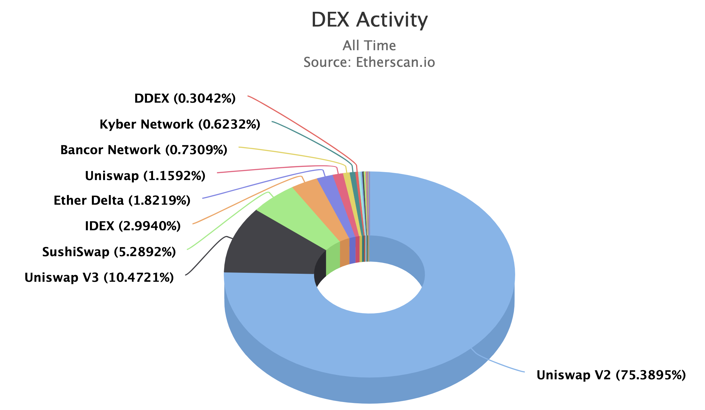
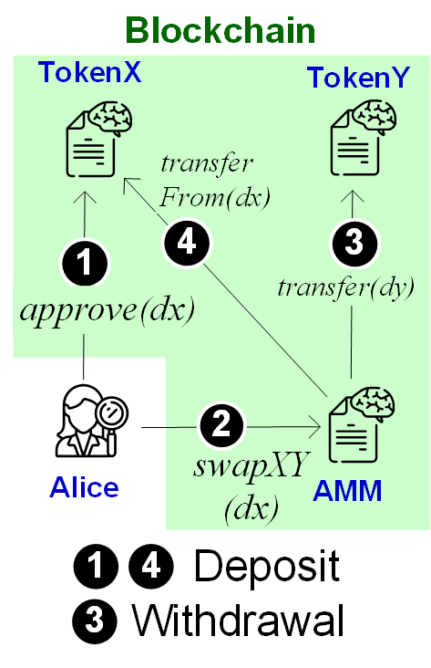

Lab B1: AMM DEX ("Build-your-own-Uniswap" Lab)
===

Introduction
---

In today's DEX market, Uniswap is the most popular service at all-time. The DEX market distribution on Ethereum can be seen in the following screenshot from https://etherscan.io/stat/dextracker.



In this lab, you will write smart contracts to implement your own version of Uniswap V3. Uniswap adopts the automated market maker (AMM) protocol in which a trader trades directly with a smart-contract intermediary called pool. This is unlike other DEX designs like order books. Besides Uniswap V3, AMM is also adopted in other popular services, including Uniswap V2, Sushiswap, Pancakeswap, etc.

We provide companion slides to introduce more background on AMM: https://www.dropbox.com/s/8749eybqaw67afd/3.DeFi-LabB1.pdf?dl=0

| Tasks | Points | CS student | Finance student |
| --- | --- | --- | --- |
|  1  | 10 |  Required | Required |
|  2  | 20 | Required | Bonus |
|  3  | 30 | Required | Bonus |
|  4  | 40 | Bonus | Bonus |
|  5  | 20 | Required | Bonus |
|  6  | 20 | Required | Bonus |

Exercise 1. Execute ERC20 token transfer
---

The following smart contract implements a very simple token supporting the essential transfer function: `transfer(address sender, address recipient, uint256 amount)` 

```
pragma solidity >=0.7.0 <0.9.0; 
contract BaddToken {  
  uint _totalSupply = 0; string _symbol;  
  mapping(address => uint) balances;  
  constructor(string memory symbol, uint256 initialSupply) {
    _symbol = symbol;
    _totalSupply = initialSupply;
    balances[msg.sender] = _totalSupply;  
  }
  
  function transfer(address receiver, uint amount) public returns (bool) {    
    require(amount <= balances[msg.sender]);        
    balances[msg.sender] = balances[msg.sender] - amount;    
    balances[receiver] = balances[receiver] + amount;    
    return true;  
  }

  function balanceOf(address account) public view returns(uint256){
    return balances[account];
  }}
```

Your job in this exercise is to deploy the above `BaddToken` SC and create a Token instance, say `TokenX`. Then, demonstrate the process that the `TokenX` issuer transfers 10 `TokenX` to another account, say Alice, and display each account's balance before/after the transfer.


Exercise 2. Extend `BaddToken` with approve/transferFrom
---

```
function approve(address spender, uint256 amount) external returns (bool);
function transferFrom(address from, address to, uint256 amount) external returns (bool);
function allowance(address owner, address spender) external view returns (uint256);
```

Your job is to extend the `BaddToken` with the `approve` and `transferFrom` functions defined as above. For example, suppose owner Alice wants to transfer 1 `BaddToken` to another account Bob, through an intermediary Charlie. Alice first calls `approve(Charlie, 1)` which gives Charlie an allowance of 1 `BaddToken`. Then, Charlie calls the function `transferFrom(Alice, Bob, 1)`, through which Bob's balance is credited by 1 `BaddToken` and Alice's balance is debited by 1 `BaddToken`.

Deploy the extended `BaddToken` SC in Remix. We use the following table to test/grade if your deployed token SC is correct. For instance, we may send a sequence of transaction against the instances of your `BaddToken`: `A.approve(C, 1)`, `balanceOf(A)`, `allowance(A, C)`, `balanceOf(B)`, `C.transferFrom(A, B, 1)`, `balanceOf(B)`. If your SC is correct, we expect the transaction returns the following: ...,`balanceOf(A)=1`, `allowance(A, C)=1`, `balanceOf(B)=0`,...,`balanceOf(B)=1`.

| Calls | `balanceOf(A)` | `balanceOf(B)` | `allowance(A,C)` | 
| --- | --- | --- | --- |
| Init state  | 1 | 0 | 0 |
| `A.approve(C,1)` | 1 | 0 | 1 |
| `C.transferFrom(A,B,1)` | 0 | 1 | 0 |

Exercise 3. AMM Design with Fixed Rate
---



The figure above shows the workflow of the fixed-rate AMM you are going to build. Initially, two token contract accounts i.e., `TokenX` and `TokenY` are created by deploying the extended `BaddToken` you built in Exercise 2.

In Step 1, trader Alice approves $x$ units of `TokenX` from her account (EOA) to the AMM `Pool`'s contract account (CA). In Step 2, Alice calls the `Pool`'s function `swapXY(dx)`. Upon receiving Alice's transaction, the `Pool` internally calls `TokenY`'s `transfer` function to transfer $dy$ units of `TokenY` to Alice (Step 3). The `Pool` also internally calls `TokenX`'s `transferFrom` function to transfer Alice's $dx$ units of `TokenX` to Bob,  spending the allowance (Step 4).

In this exercise, you can consider that $dy/dx = 2$. Implement the AMM smart contract using the following interface.

```
pragma solidity >=0.7.0 <0.9.0; 
contract AMM {
  BaddToken tokenX, tokenY;
  // _tokenX and _tokenY are contract-addresses running BaddToken SC
  constructor(address _tokenX, address _tokenY){
    tokenX = BaddToken(_tokenX); tokenY = BaddToken(_tokenY);
  }

  function swapXY(uint amountX) public payable {
    // fill out the following with your code
  } 
}
```

You can follow the workflow to execute your code.

- Write and compile a `Pool` smart contract.
- Deploy `BaddToken` smart contract twice, respectively to two contract addresses, say `TokenX` and `TokenY`.
- Deploy `Pool` smart contract with `TokenX` and `TokenY`.
- Execute the smart contracts in two steps: 
    1. call `TokenX`'s `approve` function
    2. call `Pool`'s `swapXY` function

- Hint: You need to ensure your account has enough tokens for both `TokenX` and `TokenY`. 

We will test your pool SC using the following test cases. `P` is the Pool CA, `X` is `TokenX` and `Y` is `TokenY`.

| Calls | `X.balanceOf(A)` | `X.balanceOf(P)` | `X.allowance(A,P)` | `Y.balanceOf(A)` | `Y.balanceOf(P)` |
| --- | --- | --- | --- | ---- | --- |
| Init state  | 1 | 0 | 0 | 0 | 2 |
| `A.approve(P,1)` | 1 | 0 | 1 | 0 | 2 |
| `A.swapXY(1)` | 0 | 1 | 0 | 2 | 0 |

Exercise 4. Security Analysis 
---

Now consider a thief `Bob` who inserts withdrawal (i.e., `swapXY` call) without making deposit. Here, we consider two versions: First, the thief `Bob` simply calls `swapXY` function without calling `approve`. Demonstrate your solution in Exercise 3 will produce the following test result.

| Calls | `X.balanceOf(B)` | `X.balanceOf(P)` | `X.allowance(B,P)` | `Y.balanceOf(B)` | `Y.balanceOf(P)` |
| --- | --- | --- | --- | ---- | --- |
| Init state  | 1 | 0 | 0 | 0 | 2 |
| `B.swapXY(1)` | 1 | 0 | 0 | 0 | 2 |

Second, a "frontrunning" thief `Alice` would observe another account say `Bob`'s deposit and sends her withdrawal to frontrun his withdrawal. Demonstrate your solution in Exercise 3 will produce the following test result.

| Calls | `X.balanceOf(A)` | `X.balanceOf(B)` | `X.balanceOf(P)` | `X.allowance(B,P)` | `Y.balanceOf(A)` | `Y.balanceOf(B)` | `Y.balanceOf(P)` |
| --- | --- | --- | --- | ---- | --- | --- | --- |
| Init state        | 1 | 0 | 0 | 0 | 0 | 0 | 2 | 
| `B.approve(P, 1)` | 1 | 0 | 0 | 1 | 0 | 0 | 2 |
| `A.swapXY(1)`     | 1 | 0 | 0 | 1 | 0 | 0 | 2 | 
| `B.swapXY(1)`     | 0 | 0 | 1 | 0 | 2 | 0 | 0 | 

Exercise 5. Constant-product AMM
---

Suppose the AMM account owns $x$ units of `TokenX` and $y$ units of `TokenY`. The AMM pool can use a function $f(x,y)$ to calculate the exchange rate between `TokenX` and `TokenY` on the fly. Specifically, it enforces that function value is constant before and after each token swap, that is,

$$f(x,y)=f(x+dx,y-dy)$$

In this exercise, you are asked to implement constant-product AMM (adopted in the real-life Uniswap), where $f(x,y)=x\*y$. Modify your AMM smart contract to support the constant-product invariant $x\*y=(x+dx)(y-dy)$.

- Hint: You may want to keep track of token balance $x$ and $y$ in the AMM smart contact by issuing `balanceOf` in each `swapXY` call.

We will test your solution using the following test case:


| Calls | `X.balanceOf(A)` | `X.balanceOf(P)` | `X.allowance(A,P)` | `Y.balanceOf(A)` | `Y.balanceOf(P)` |
| --- | --- | --- | --- | ---- | --- |
| Init state  | 1 | 1 | 0 | 0 | 4 |
| `A.approve(C,1)` | 1 | 1 | 1 | 0 | 4 |
| `A.swapXY(1)` | 0 | 2 | 0 | 2 | 2 |

Exercise 6. Refund Lost Tokens upon Standalone Withdrawal 
---

In Exercise 5, consider an Alice who called `approve` function (the Deposit step) but did not call `swapXY` (the Withdrawal step). In practice, a possible reason is that Alice regrets the trade when the deposit is made and wants to undo it.

Extend your pool SC from the previous exercises to allow Alice to revert a swap already in progress. You may want to implement a function in the AMM pool, say `refund()`. After Step 1 and calling `refund()`, Alice will have her original balance in `TokenX` and zero allowance to the pool. That is (`P` is the Pool CA):

| Calls | `balanceOf(A)` | `balanceOf(P)` | `allowance(A,P)` | 
| --- | --- | --- | --- |
| Init state  | 1 | 0 | 0 |
| `A.approve(C,1)` | 1 | 0 | 1 |
| `A.refund()` | 1 | 0 | 0 |


<!--

The exercises so far (from 1 to 4) consider the normal scenarios. Starting from this exercise, we will consider a series of abnormal or security-oriented cases where Alice deviates from the normal cases, as shown in the following table.

| Case | tx1 | tx2 | Solution |
| --- | --- | --- | --- |
|  Normal case | Alice | Alice | Exercise 1-4 |
|  Standalone deposit  | Alice | NULL | Exercise 5 |
|  Standalone withdrawal (Pool theft) | NULL | Alice | Exercise 6 |
|  Unmatched swap (Trader theft) | Bob  | Alice | Exercise 7 |


Exercise 6. Security Hardening against Pool Theft
---

Consider an Alice who called `swapXY` (the Withdrawal step) but did not call `approve` (the Deposit step). In practice, this behavior can be due to Alice being an adversarial user who wants to steal tokens from the pool.

Extend your pool SC from the previous exercises to defend the pool against theft. Specifically, a standalone call to the `swapXY` without `approve` does not transfer any tokens. That is (`P` is the Pool CA):


| Calls | `X.balanceOf(A)` | `X.balanceOf(P)` | `X.allowance(A,P)` | `Y.balanceOf(A)` | `Y.balanceOf(P)` |
| --- | --- | --- | --- | ---- | --- |
| Init state  | 1 | 0 | 0 | 0 | 2 |
| `A.swapXY(1)` | 1 | 0 | 0 | 0 | 2 |

To do so, you may want to make the pool SC track all swaps in progress (i.e., the swap that did deposit but did not finish withdrawal), so that an attempt to withdraw when there are no other ongoing swaps will be declined. 

Hint: Your pool SC can make a copy of the token balance so that an ongoing swap will appear as a difference between the balance in the token SC and the copy of the balance in the pool SC.


Exercise 7 (Bonus). Security Hardening against Trader Theft
---

A sophisticated attacker can try to insert a withdrawal call (`swapXY`) in between a benign user’s deposit and withdrawal to steal his tokens. For example, consider that an attacker Alice who observes that benign user Bob’s deposit (`approve`) issues the call of `swapXY` to withdraw Bob’s token. 

Design a defense against the above theft attack and implement it in your pool SC.

Hint: Consider delegating EOA traders' actions to a separate smart contract (i.e., the router SC design in Uniswap V2).

-->

Deliverable
---

- For all tasks, you should 1) submit your smart-contract code, and 2) show the screenshot of the program execution. 

