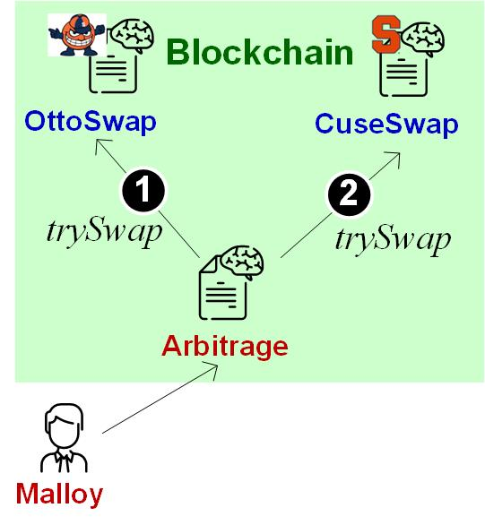
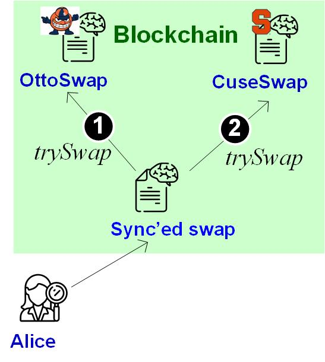

Lab B3: DEX security: Arbitrage 
===

Introduction
---

In traditional finance, arbitrage is defined as the purchase and sale of the same asset in different markets in order to profit from differences in exchange rate. The same attack applies to decentralized exchanges (DEXes), where an attacker trades with two DEX pools and exercise buy-low-sell-high strategy. 

In this lab you will pretend to be both the attacker and defender taking steps to exploit an arbitrage opportunity and to prevent it from happening.

Task 1. Attack across DEXes
---

Let's assume there are two DEXes, Ottoswap and Cuseswap. Ottoswap was willing to trade 10 `TokenX` per ``TokenY`` and Cuseswap was willing to trade 300 `TokenX` per `TokenY`. Attacker Alice could buy 10 `TokenX` for 1 `TokenY` from Ottoswap and then trade 10 `TokenX` for 2 `TokenY` on Cuseswap yielding a 1 `TokenY` profit. 

While Alice can do the two trades in two separate transactions, Alice may  face the risk of failing one transaction and losing value. In practice, attackers commonly deploy a smart contract to send the two trade transactions atomically in order to guarantee the attack success and profitability. 

Your job is to create such an arbitrage smart contract that collects the arbitrage profit. The setting is shown in the above diagram including the two token contracts, ``TokenX`` and ``TokenY``, and their exchange rates on the two DEXes (Ottoswap and Cuseswap). 

Your arbitrage smart contract should invoke Ottoswap's swap function to trade ``TokenY`` for ``TokenX`` and then invoke Cuseswap's swap function to trade `TokenX` for `TokenX`. Your arbitrage smart contract should print its initial balance and the balance in the end.

Task 2. Arbitrage Mitigation by Synchronized Swaps
---

In this task you will take the second approach, trading across DEXes to ensure an arbitrage opportunity isn't created. Create a smart contract that routes transactions between Ottoswap and Cuseswap to ensure an exchange imbalance is never created.

- Include pictures showing the `TokenX` and `TokenY` balances of Ottoswap and Cuseswap after your contract executes.
- Deploy `MyToken` smart contract twice to create instances of `TokenY` and `TokenX`
- Deploy Ottoswap and Cuseswap 
- Both Ottoswap and Cuseswap have reserves of 10 `TokenY` and 5 `TokenX` 
- Fund Alice with 2 `TokenY`
- Swap Alice's `TokenY` on both Ottoswap and Cuseswap simultaneously
 
Deliverable
---

1. For all tasks, you should submit screenshots showing your contract executing the described workflow successfully.
 
2. Submit your solidity smart contracts for each task. 

